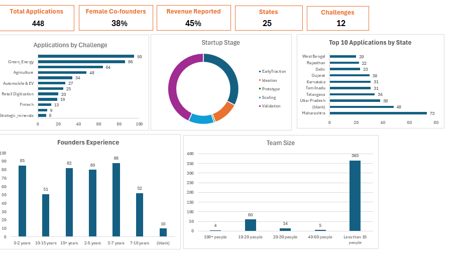
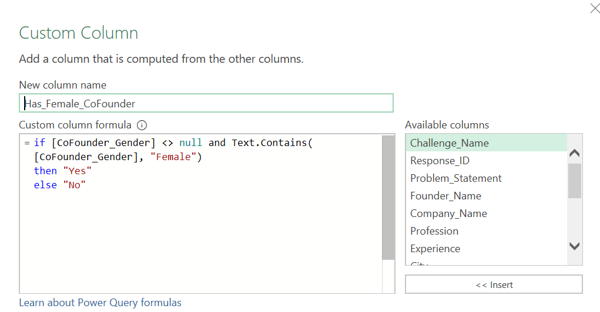

# 🚀 Bharat Startup Grand Challenge (BSGC) – Startup Application Analysis



> **End-to-End Excel Data Analytics Project** using **Microsoft Excel, Power Query, Pivot Tables, Pivot Charts, and Dashboard Visualization**.

---

# 📌 Project Overview

This project analyzes startup applications submitted under the **Bharat Startup Grand Challenge (BSGC)**.

The original dataset consisted of multiple Excel workbooks containing inconsistent, duplicate, and unstructured startup application data. Using Power Query, the data was consolidated, cleaned, standardized, and transformed into a single analytical dataset.

The final dataset was used to build an executive dashboard that provides meaningful business insights for startup applications across different challenges, startup staages, founder experience, and geographical distribution.

---

# 🎯 Business Problem

The startup application data contained several real-world data quality issues:

- Multiple Excel workbooks
- Inconsistent text values
- Different naming conventions
- Missing values
- Duplicate information
- Unstructured categorical data

The objective was to create a clean dataset suitable for business analysis and dashboard reporting.

---

# 🛠 Tools Used

- Microsoft Excel
- Power Query
- Pivot Tables
- Pivot Charts
- Excel Dashboard
- Data Cleaning
- Data Transformation
- Feature Engineering

---

# 📂 Dataset Summary

| Metric | Value |
|---------|------:|
| Total Applications | 448 |
| Startup Challenges | 12 |
| States Covered | 25 |
| Dashboard KPIs | 5 |
| Dashboard Charts | 5 |

---

# 🧹 Data Cleaning & Transformation

Power Query was used to perform the complete ETL (Extract, Transform, Load) process.

### Cleaning Steps

- Combined multiple Excel files into one dataset
- Standardized inconsistent state names
- Corrected startup stage values
- Cleaned categorical columns
- Removed unnecessary fields
- Handled missing values
- Created **Revenue Status** feature
- Created **Female Co-Founder Indicator**
- Standardized application data
- Validated final dataset before loading into Excel

---

# 📊 Dashboard KPIs

- Total Applications
- Startup Challenges
- States Covered
- Female Co-Founder %
- Revenue Reported %

---

# 📈 Dashboard Visualizations

- Applications by Challenge
- Startup Stage Distribution
- Top 10 Applications by State
- Founder Experience Distribution
- Team Size Distribution

---

# 💡 Key Insights

- Green Energy received the highest number of startup applications.
- Most startups are currently in the Prototype and Early Traction stages.
- Maharashtra contributed the highest number of startup applications.
- 38% of startups included at least one female co-founder.
- 45% of startups reported revenue.

---

# 📷 Project Screenshots

## Dashboard


---

## Power Query - Applied Steps



---

## Data Cleaning


---

# 🎯 Skills Demonstrated

- Data Cleaning
- Data Transformation
- Power Query
- Data Validation
- Feature Engineering
- Pivot Table Analysis
- Dashboard Design
- Business Analysis
- Data Visualization
- Excel Reporting

---

# 📁 Repository Structure

```
BSGC-Startup-Application-Analysis
│
├── Documents
│   └── BSGC_dashboard.pdf
│
├── Images
│   ├── All-charts.png
│   ├── Applied Steps.png
│   ├── Data cleaning process.png
│   └── ...
│
└── README.md
```

---

# 🚀 Future Improvements

- Interactive slicers across all dashboard visuals
- Power Pivot & DAX implementation
- Power BI version of the dashboard
- SQL-based data pipeline
- Advanced business KPIs

---

# 👨‍💻 About This Project

This project was built as part of my Data Analytics learning journey to practice working with real-world startup application data using Microsoft Excel and Power Query.

The focus was not only on building a dashboard but also on following a complete analytics workflow including data cleaning, transformation, feature engineering, business analysis, and dashboard design.

---

## ⭐ If you found this project useful, feel free to star the repository.